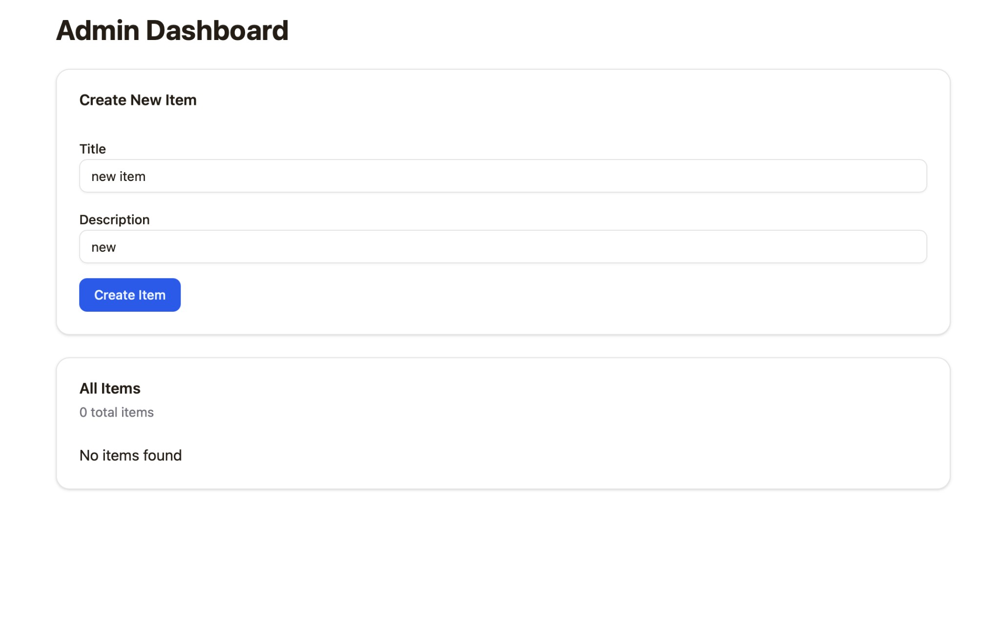
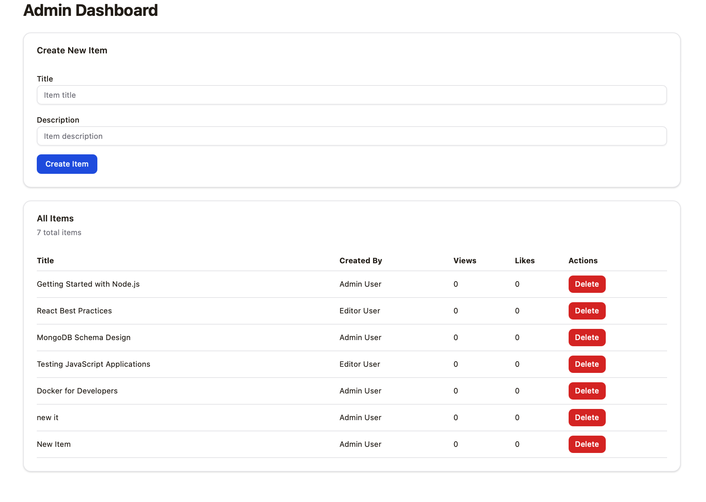

## QA Assignment Report – Buggy MERN App

Test approach, what was run, defects found, and recommendations for the assignment MERN app.

---

## 1. Overview

- **Application under test**
  - MERN‑stack web application with JWT auth, role‑based access, file uploads, and Docker deployment.
- **Purpose of testing**
  - To uncover functional, security, performance, API contract, and UX issues and demonstrate a structured QA approach.
- **Time window**
  - Seven‑day assignment window, with a focus on risk‑based coverage rather than exhaustive testing.

---

## 2. Test Strategy Summary

Summary of `TEST_STRATEGY.md`.

- **Scope**
  - Core user journeys (signup, login, item management, file uploads).
  - API contracts for auth and items endpoints.
  - Role‑based access control for user, editor, and admin.
  - Basic non‑functional checks (performance sanity and accessibility scan).

- **Approach**
  - Start with exploratory testing to build an understanding of behaviour and risks.
  - Design at least 40–50 structured test cases covering UI, API, auth/RBAC, file upload, and non‑functional aspects.
  - Implement automated tests:
    - Unit and integration tests for backend auth and items logic.
    - Selected E2E flows for critical user journeys.

- **Prioritisation**
  - Highest priority on security‑sensitive areas (auth, RBAC, token handling, input validation).
  - Next on business‑critical flows (items CRUD, uploads).
  - Then UX, performance, and responsiveness issues.

---

## 3. Test Environment

- **Environment configuration**
  - Docker Compose (see root README). Alternative: local Node + MongoDB.
  - Alternative: Local Node + MongoDB if required.
- **Seed data**
  - Default accounts:
    - Admin: `admin@example.com` / `AdminPass123!`
    - Editor: `editor@example.com` / `EditorPass123!`
    - User: `user@example.com` / `UserPass123!`
- **Browsers and tools**
  - Main browser: a modern Chromium‑based browser.
  - Additional browser: optionally Firefox or Safari if time allowed.
  - Tools: browser devtools, test runner (Vitest), E2E framework, simple performance and accessibility tooling.

---

## 4. Test Coverage Summary

- **Manual test cases**
  - Total designed: 48 (TEST_CASES.md).
  - Executed: 12 (smoke + login + RBAC + create item).
  - Passed: 8. Failed: 4 (signup, seed duplicate, token expiry, pagination before fix).
  - Blocked / not run: 36.

- **Automated tests**
  - Unit: auth-utils (token verify), existing auth.logout caller test.
  - Integration: API login + GET items (see `server/api-integration.test.ts`); smoke script covers login, items GET/POST.
  - E2E: two flows in `e2e/login-items.spec.ts` – (1) login then view items on home, (2) admin login then open Admin Dashboard; run with `npm run test:e2e` (see README).

- **Gaps and limitations**
  - E2E covers two critical paths (login→home, admin→dashboard); accessibility and performance checks not run. File upload and refresh-token flow lightly covered.

---

## 5. Defects Found

Key defects with steps, expected/actual, severity, and (where found) root cause and fix.

| ID      | Title                                       | Area          | Severity | Priority | Status  | Summary                                                                                  | Related Test Case(s) |
|---------|---------------------------------------------|---------------|----------|----------|---------|------------------------------------------------------------------------------------------|----------------------|
| BUG-001 | Items list pagination wrong: page 1 empty   | API / Items   | High     | P1       | Fixed   | GET /api/items used skip = page * limit so page 1 skipped first 50; list showed 0 items. | API-03, REG-01, UI-05 |
| BUG-002 | Create Item button: no feedback on failure | UX / Items    | Medium   | P2       | Fixed   | Admin Dashboard create form did not show error when POST failed; button appeared static.  | UI-11, REG-02        |
| BUG-003 | Create item returns "Invalid token" after access token expiry | Auth / API   | High     | P1       | Documented | Access token expires in 5m; no refresh on 401; protected actions fail until re-login.   | AUTH-06, REG-02      |

Setup defects (8), found during environment setup:

| ID | Summary | Severity | Fix applied |
|----|---------|----------|-------------|
| SETUP-01 | Dockerfiles require `pnpm-lock.yaml` which is not in repo; build fails. | Medium | Copy only package.json; run pnpm install. |
| SETUP-02 | Dockerfiles do not copy `patches/`; pnpm patchedDependencies fail. | Medium | COPY patches in both Dockerfiles. |
| SETUP-03 | `patchedDependencies` targets wouter@3.7.1 but dependency range resolves to other version; patch not applied. | Medium | Pin wouter to 3.7.1 in package.json. |
| SETUP-04 | docker-compose sets only MONGODB_URI; API uses DATABASE_URL and falls back to localhost; API cannot connect to Mongo in Docker. | High | Set DATABASE_URL in api service. |
| SETUP-05 | Web service runs `npm run dev` (API) instead of frontend; nothing listens on container port 3000. | High | command: npm run dev:web. |
| SETUP-06 | Web Dockerfile does not copy vite.config.ts; Vite uses default port 5173; host mapping 3002:3000 has no service. | High | COPY vite.config.ts in Dockerfile.web. |
| SETUP-07 | Web Dockerfile does not copy shared/; @shared/const cannot be resolved in browser. | High | COPY shared in Dockerfile.web. |
| SETUP-08 | docker-compose.yml uses obsolete `version` key; Compose logs warning. | Low | Remove version key. |

---

### BUG-003: Create item returns "Invalid token" (expired access token, no refresh)

- **Title:** Creating a new item (or other protected action) returns "Invalid token" after the access token has expired.
- **Environment:** Any; occurs when more than 5 minutes have passed since login (or after token expiry).
- **Preconditions:** User logged in earlier; access token since expired (default expiry was 5 minutes).
- **Steps to reproduce:**
  1. Log in as admin or editor.
  2. Wait more than 5 minutes (or use an old session).
  3. Go to Admin Dashboard and click "Create Item" with title/description filled.
- **Expected result:** Either the app refreshes the access token using the refresh token and the request succeeds, or the user is redirected to login with a clear message (e.g. "Session expired").
- **Actual result:** API returns 401 with `{ error: "Invalid token" }`. The create form now shows this error (after BUG-002 fix), but the user must log in again manually; there is no automatic token refresh or redirect.
- **Root cause:** Access tokens are issued with a 5-minute expiry (`ACCESS_TOKEN_EXPIRY = '5m'` in `server/auth-utils.ts`). The frontend does not call `/api/auth/refresh` when a request returns 401, and does not redirect to login when the token is expired. So after 5 minutes, all protected API calls fail with "Invalid token".
- **Fix (for testing):** Access token expiry was made configurable and default increased to 1h (`ACCESS_TOKEN_EXPIRY` env or default `'1h'`). For production, the app should implement: on 401 from any protected request, call refresh endpoint with refresh token; if refresh succeeds, retry the request; if refresh fails, redirect to login with "Session expired".
- **Severity:** High (users lose ability to perform actions after short inactivity; poor UX and no clear recovery path).

---

### BUG-001: Items list pagination wrong (page 1 empty)

- **Title:** Items list and Admin Dashboard "All Items" show 0 items on page 1 despite items existing.
- **Environment:** Docker (web + api); browser at http://localhost:3002; seeded DB with 5 items.
- **Preconditions:** Logged in as admin or editor; navigate to Items list or Admin Dashboard.
- **Steps to reproduce:**
  1. Log in as admin@example.com.
  2. Open Admin Dashboard (or main Items page).
  3. Observe "All Items" / items list.
- **Expected result:** First page shows the first N items (e.g. 5 items when limit=50).
- **Actual result:** "0 total items" / "No items found" (see screenshot below). Creating a new item also appeared to do nothing because the list refetched with the same wrong pagination.
- **Root cause:** In `server/routes/items.ts`, pagination used `skip = page * limit`. For page 1 and limit 50 that yields skip=50, so the API skipped the first 50 rows and returned items 51–100. With only 5 items in the DB, the result set was always empty.
- **Fix:** Use `skip = (page - 1) * limit` so page 1 returns the first page of results.
- **Evidence:** Screenshot – Admin Dashboard with "Create New Item" filled (Title: "new item", Description: "new") and "All Items" showing "0 total items" / "No items found" after clicking Create Item.

---

### BUG-002: Create Item button gives no feedback on failure

- **Title:** Clicking "Create Item" on Admin Dashboard appears to do nothing when the request fails.
- **Environment:** Same as BUG-001.
- **Preconditions:** Admin Dashboard open; form filled with title and description.
- **Steps to reproduce:**
  1. Enter title and description.
  2. Click "Create Item".
  3. If the POST fails (e.g. 401/403/500), observe the UI.
- **Expected result:** User sees an error message (e.g. "Failed to create item" or the API error).
- **Actual result:** No message; form stays as-is; "Create Item" button appears static. User cannot tell whether the request was sent or why it failed.
- **Root cause:** `client/src/pages/AdminDashboard.tsx` did not read the non-OK response body or set any error state; only `response.ok` branch cleared the form and refetched.
- **Fix:** Parse response body, set a `createError` state from `data.error` or a generic message when `!response.ok`, and render that message above the form. On success, clear the error.
- **Severity:** Medium (workflow blocked without feedback; no data loss).

---

### Evidence after fix (Create Item and list working)

After fixing pagination (BUG-001), token expiry workaround (BUG-003), and error display (BUG-002), the Admin Dashboard correctly shows all items and new items can be created.

---

## 6. Notable Findings and Risk Assessment

Use this section to highlight:

- Clusters of issues in particular modules (e.g. RBAC leaks, weak validation on specific endpoints).
- Patterns of insecure or brittle behaviour (e.g. tokens exposed, inconsistent error handling).
- Areas that appear stable or low‑risk based on executed tests.

---

## 7. Recommendations and Next Steps

- **Immediate**
  - Fix pagination (skip formula) and token refresh on 401 so create/list and session behaviour are correct in production.
  - Add error feedback on all forms (create item fix applied; replicate for signup/login where missing).

- **Short‑term**
  - Implement refresh-on-401: on 401 from protected endpoints, call `/api/auth/refresh` and retry or redirect to login with "Session expired".
  - Make signup endpoint return 400 with clear message when user exists; fix signup response status (currently 201 with error body).
  - Seed script: handle duplicate key (skip or upsert) so re-seed does not fail.

- **Medium‑term**
  - Expand E2E (e.g. create item, delete item) beyond the current two flows.
  - Add API integration tests for RBAC (user/editor cannot DELETE, editor can POST/PUT).
  - Run Lighthouse and axe on main pages; document results.

---

## 8. Appendix

- **Screenshots (in repo):**
  - `assets/bug_admin_dashboard_empty_list.png` – BUG-001: Admin Dashboard showing "0 total items" / "No items found" (pagination bug).
  - `assets/admin_dashboard_7_items_after_fix.png` – Admin Dashboard after fix showing "7 total items" and newly created items ("new it", "New Item").
- **Docs:**
  - `TEST_STRATEGY.md` – full strategy.
  - `TEST_CASES.md` – detailed test case catalogue.
  - Any scripts or configuration files used for automation or environment setup.

